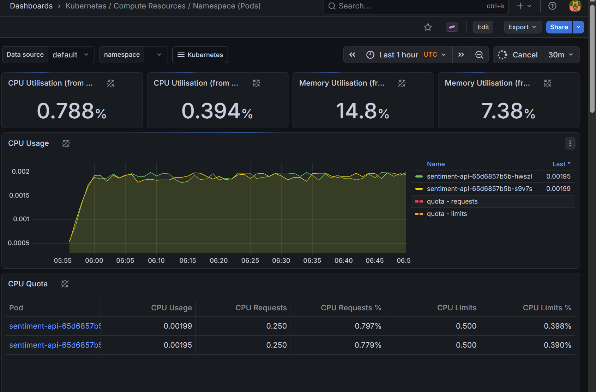

-----------------------
### Kubernetes / Compute Resources / Namespace (Pods)
ഇതാണ് ഏറ്റവും കൂടുതൽ ശ്രദ്ധിക്കേണ്ട ഡാഷ്ബോർഡ്. ഇത് നമ്മുടെ ആപ്പ് (sentiment-api) എത്രമാത്രം പവർ ഉപയോഗിക്കുന്നു എന്ന് കാണിക്കുന്നു.

എന്താണ് കാണിക്കുന്നത്?: ന്റെ ചേട്ടായിയുടെ ആപ്പിന്റെ രണ്ട് പോഡുകൾ (sentiment-api-...) എത്ര സിപിയു, മെമ്മറി എന്നിവ എടുക്കുന്നു എന്ന് ഈ ഗ്രാഫ് കാണിക്കുന്നു.

എങ്ങനെ വായിക്കാം?: ഗ്രാഫിലെ പച്ച, മഞ്ഞ വരകൾ രണ്ട് വ്യത്യസ്ത പോഡുകളെ സൂചിപ്പിക്കുന്നു. CPU Usage ഇപ്പോൾ 0.002 ന് അടുത്താണ്, അതായത് ആപ്പിൽ വലിയ ലോഡ് ഇല്ല.

Production Example: പെട്ടെന്ന് ഒരുപാട് യൂസർമാർ ആപ്പ് ഉപയോഗിക്കാൻ തുടങ്ങിയാൽ ഈ ഗ്രാഫിലെ വരകൾ കുത്തനെ മുകളിലേക്ക് പോകും. അത് നമ്മൾ സെറ്റ് ചെയ്ത Limit (ചുവന്ന വര) തൊടുകയാണെങ്കിൽ ആപ്പ് സ്ലോ ആകാൻ സാധ്യതയുണ്ട്. അപ്പോൾ കൂടുതൽ പോഡുകൾ ആഡ് ചെയ്യേണ്ടി വരും.

