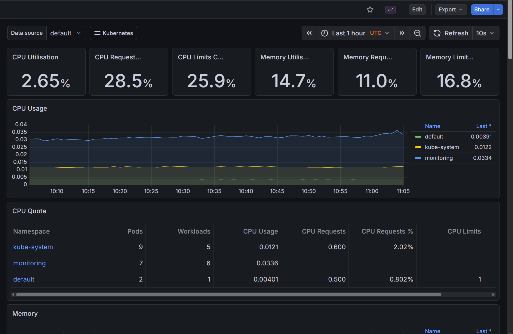

------------------
ഇത് മൊത്തം EKS ക്ലസ്റ്ററിന്റെ (എല്ലാ നോഡുകളും ചേർന്ന്) അവസ്ഥയാണ്.

എന്താണ് കാണിക്കുന്നത്?: ക്ലസ്റ്ററിലെ മൊത്തം സിപിയു വിനിയോഗം (CPU Utilisation) വെറും 0.0231 ആണ്. അതായത് ക്ലസ്റ്റർ വളരെ റിലാക്സ്ഡ് ആണ്.

എങ്ങനെ വായിക്കാം?: Memory Utilisation നോക്കൂ, അത് 14.5% ആണ്. ബാക്കി 85% സ്ഥലവും ഇപ്പോഴും കാലിയാണ്.

Production Example: നമ്മൾ ക്ലസ്റ്ററിൽ പുതിയ പുതിയ ആപ്പുകൾ ഇൻസ്റ്റാൾ ചെയ്യുമ്പോൾ ഈ ശതമാനം കൂടി വരും. ഇത് 80% ന് മുകളിൽ പോയാൽ പുതിയ EC2 ഇൻസ്റ്റൻസുകൾ (Nodes) ക്ലസ്റ്ററിലേക്ക് ആഡ് ചെയ്യേണ്ട സമയം ആയി എന്ന് മനസ്സിലാക്കാം.
