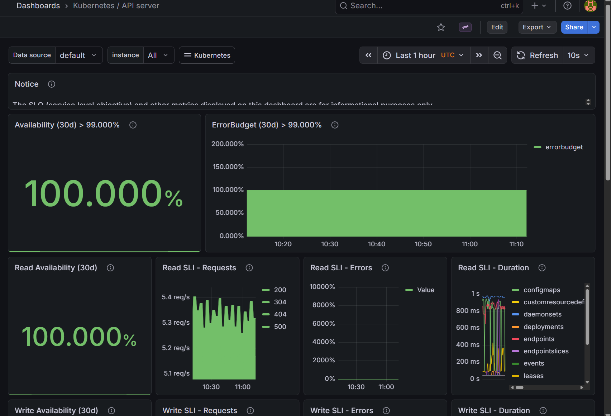

------------------------

ഇത് നമ്മുടെ API സെർവറിന്റെ ആരോഗ്യമാണ്.

എന്താണ് കാണിക്കുന്നത്?: Availability ഇപ്പോൾ 100.000% ആണ്. അതായത് നമ്മുടെ ക്ലസ്റ്റർ ഒരു സെക്കൻഡ് പോലും ഡൗൺ ആയിട്ടില്ല.

എങ്ങനെ വായിക്കാം?: Read SLI - Requests എന്നത് നമ്മൾ kubectl കമാൻഡുകൾ അടിക്കുമ്പോഴും മറ്റും API സെർവറിന് വരുന്ന റിക്വസ്റ്റുകളാണ്.

Production Example: ന്റെ ചേട്ടായി ഒരു കമാൻഡ് അടിക്കുമ്പോൾ "Connection Refused" എന്ന് വരികയാണെങ്കിൽ ഇവിടെ അവൈലബിലിറ്റി 100%-ൽ താഴെ വരുന്നത് കാണാം. ഇത് ക്ലസ്റ്റർ മാനേജ്മെന്റിൽ വളരെ പ്രധാനമാണ്.
