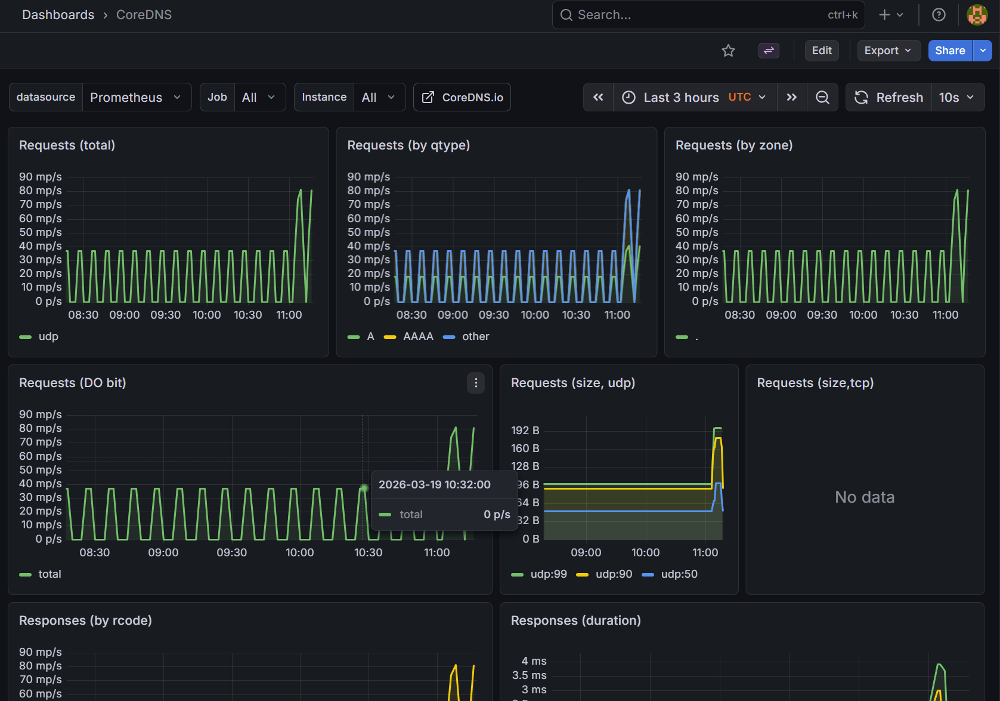

----------------------------

ക്ലസ്റ്ററിനുള്ളിലെ നെറ്റ്‌വർക്കിംഗ് കാര്യങ്ങൾ നോക്കുന്നതാണ് CoreDNS.

എന്താണ് കാണിക്കുന്നത്?: ക്ലസ്റ്ററിനുള്ളിലെ പോഡുകൾ തമ്മിൽ സംസാരിക്കാൻ ഉപയോഗിക്കുന്ന DNS റിക്വസ്റ്റുകൾ ഇവിടെ കാണാം.

Production Example: ആപ്പിന് ഡാറ്റാബേസുമായി കണക്ട് ചെയ്യാൻ പറ്റുന്നില്ലെങ്കിൽ ചിലപ്പോൾ പ്രശ്നം DNS ആയിരിക്കാം. അപ്പോൾ ഈ ഗ്രാഫിലെ Error റേറ്റ് പരിശോധിക്കണം.
